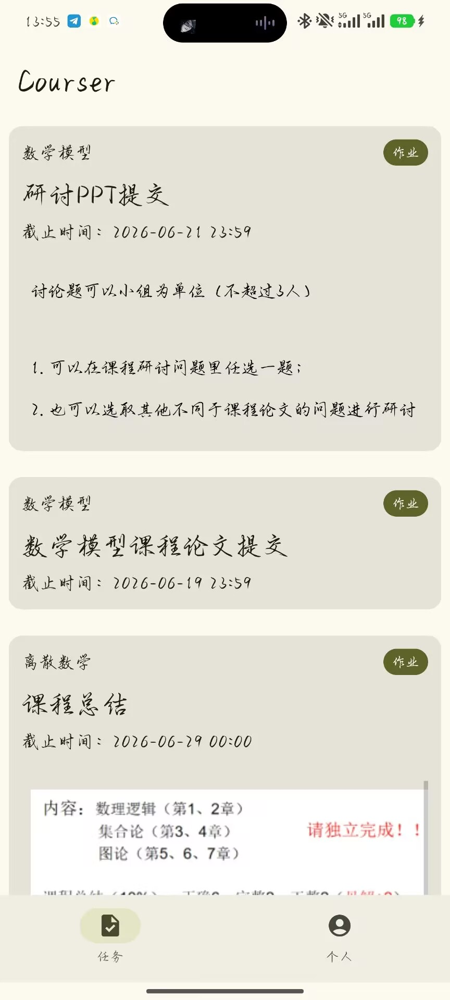

# Courser
一个用于更方便BUCTer查看作业（目前）的App。

## 加入反馈&开发
[Q群](https://qm.qq.com/q/er5fUjW1Ik)

## 一些问题
### Q：我把账号密码输入给app了会不会造成泄露
**A：** 从我自己的主观意愿上讲不会，
1. 我的动机上没有必要搜集这些数据，除了帮用户退选课🤓👆，
2. 你花服务器接口用http+body明文传输学号和密码，我想要获取账号密码完全不需要使用如此“高成本”的方式
3. 开源了

>叠甲：不是安卓pro，出了什么意料之外的岔子我也不好预测，反正我主观上没必要拿这些信息。第二是接口都这样了，我再出什么岔子也没这个接口问题大。🤓

### Q：这个App的用处是什么
**A：** 这个App接入的是某慕课的接口。本人经常需要看作业是什么，但是你花的网站非常之难用，每次进去都登陆很烦。某慕课的自动登录经常失效，且，主页放个courseList干嘛，我进某慕课肯定是为了看有什么作业没写啊。所以很显然我切换了App的一些UI逻辑。

### Q：为什么是App而不是Web
**A：** App更方便接入一些权限，例如新作业通知，虽然我现在还没做🤓，等到初始功能稳定了会继续。